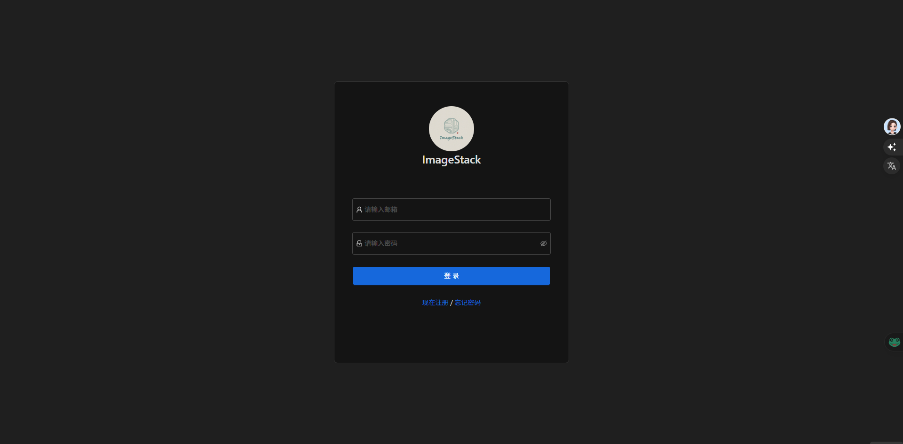

# ImageStack

## 项目简介
ImageStack 是一个开源的图片管理系统，提供图片上传、浏览、下载等功能，采用前后端分离的架构设计。系统支持用户管理、权限控制、图片处理和搜索等功能，是一个功能完善的图片存储与管理平台。

# 界面
1. 登录

2. 注册

3. 忘记密码

4. dashboard

5. photos

6. tags

7. trash

8. profile


## 技术栈

### 后端 (NestJS)
- 框架：NestJS
- 数据库：MySQL + Redis + Elasticsearch
- 对象存储：MinIO
- 认证：Passport (JWT + Local)
- 其他特性：
  - 邮件服务 (Nodemailer)
  - 定时任务 (@nestjs/schedule)
  - API文档 (@nestjs/swagger)
  - TypeORM
  - HTTP客户端 (@nestjs/axios)

### 前端 (Vue3)
- 框架：Vue 3 + TypeScript
- 状态管理：Pinia
- UI组件库：Ant Design Vue
- 构建工具：Vite
- CSS框架：Tailwind CSS
- 其他特性：
  - Vue Router
  - ECharts 数据可视化
  - VueUse Head

## 功能特性

### 用户系统
- [x] 用户注册
- [x] 用户登录
- [x] 邮箱验证
- [x] RBAC权限管理
- [x] 用户信息更新
- [x] 密码找回

### 图片系统
- [x] 图片上传
- [x] 图片浏览
- [x] 图片下载
- [x] 图片标签管理
- [x] 图片回收站
- [x] 短链接生成
- [x] 二维码生成
- [ ] 更多功能开发中...

### 系统管理
- [x] 磁盘信息监控
- [x] 请求日志记录
- [x] 数据统计与图表展示

## 项目架构

```
├── 前端 (Vue3 + TypeScript)
├── 后端 (NestJS)
```

## 开发环境要求
- Node.js (v22)
- MySQL (v8+)
- Redis (v6+)
- MinIO

## 项目设置

### 后端设置
```bash
# 安装依赖
npm install

# 开发模式运行
npm run start:dev

# 生产模式构建
npm run build

# 生产模式运行
npm run start:prod
```

### 前端设置
```bash
# 进入前端目录
cd front

# 安装依赖
npm install

# 开发模式运行
npm run dev

# 构建生产版本
npm run build

# 预览生产构建
npm run preview
```

## 项目配置
- 后端配置文件：`src/config.ts`
- 前端配置：
  - Vite配置：`front/vite.config.ts`
  - TypeScript配置：`front/tsconfig.json`
  - Tailwind配置：`front/tailwind.config.js`

## 数据库迁移
```bash
# 创建迁移
npm run migration:create

# 生成迁移
npm run migration:generate

# 运行迁移
npm run migration:run

# 回滚迁移
npm run migration:revert
```

## 主要功能说明

### 图片管理
- 支持多种格式图片上传
- 图片元数据提取
- 图片标签管理
- 回收站功能
- 短链接和二维码生成

### 用户管理
- 基于JWT的身份验证
- 基于角色的访问控制(RBAC)
- 邮箱验证和密码重置

### 系统监控
- 磁盘使用情况监控
- 请求日志记录和分析
- 图片上传趋势统计

## 部署

### Docker部署
项目支持Docker部署，相关配置文件：
- Dockerfile
- .dockerignore

## 许可证
MIT License

## 贡献指南
欢迎提交Issue和Pull Request来帮助改进项目。

## 项目状态
目前项目处于开发阶段，核心功能已经实现，更多功能正在开发中。